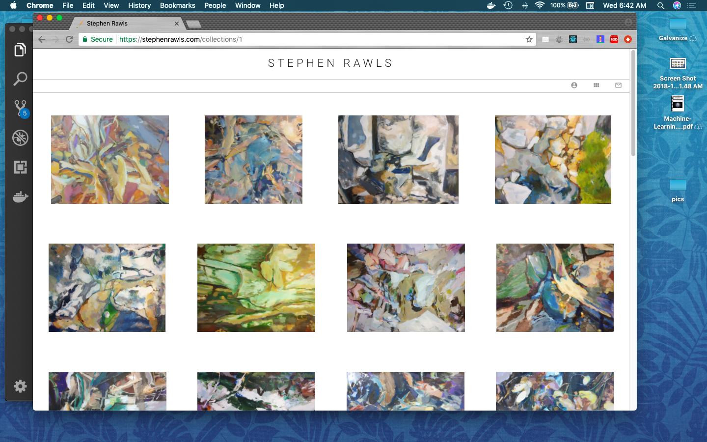

This application is a portfolio website that allows the owner of the website to upload and manage collections of images. An artist friend wanted a website that he could use to share his paintings with friends and family.

Technical Elements:
* React & Redux UI
* Node.js server
* Cloudinary for image hosting
* Digitalocean for site hosting

### Frontend

The React frontend communicates with the node.js API, which sends metadata about the images, including links to the cloudinary images. The admin features are only available via route. By navigating to baseurl/login, the user enters credentials and recieves a jwt, which is sent back with all post/save requests.

### Server

The node server is a simple REST api. I initially considered graphQL, but decided that the data structure was a classic case for REST architecture. There are CRUD routes for albums, images, and information. Albums and images are linked by a join table which also contains sorting order for displaying images within an album.

### Deployment

The site was deployed on a digitalocean droplet, where I installed git and pm2. I have been SSHing into the environment to pull down latest, which is kind of a pain. Next time, I will definitely try and integrate with Travis or Jenkins to make it less painful.

The site is hosted through NGINX reverse proxy, which serves up the static files and routes API requests to the node server. I set up environment variables while in the shell. I copied all the passwords into my notes, but there is probably a better way of maintaining continuity of environment variables between environmnents.

I used letsencrypt for a SSL cert and goDaddy for domain name. 

Getting everything right on Nginx and SSL was not fun, but it seems to be working.

Check out the live site [here.](https://stephenrawls.com)
